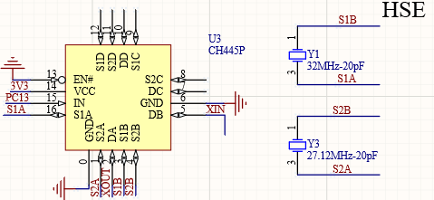
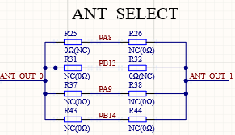
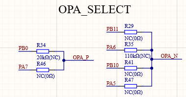
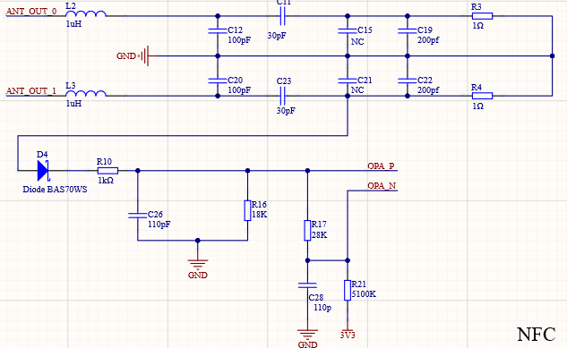

# CH32V208 NFC双晶振低功耗检卡硬件

## 电路板介绍

NFC必须采用13.56Mhz频率作为基波进行通讯，而蓝牙必须采用32M晶振。所以本工程采用了双晶振模式，使用CH445P进行切换晶振。

默认使用串口2进行调试，即电路板上的PA2脚为调试串口输出。

## 硬件电路讲解

### 程序下载

电路板提供了三个按键，其中就有`Download`按键。使用typec线连接电路板至电脑，按住`Download`键，打开开关即可使用ISP工具下载。

### 晶振电路

采用CH445P对晶振进行切换，本参考电路中采用PC13引脚进行切换：高电平切换为27.12Mhz、低电平切换为32Mhz晶振。

由于晶振电路增加了CH445P，电路寄生电容增大，而芯片内部集成了负载电容切最低只能为8pf，所以32M晶振和27.12M晶振必须使用**20pF**或以上负载电容的晶振。

在使用20pF负载电容的晶振时，CH32V208内部的负载电容档位`HSE_CAL_CTRL`中的`HSEC[3:0]`需要调节至`0b100`选项，即16pF。在不同的电路中，可以使用频谱仪进行测试确定最优值。

### 天线输入选择

天线输入需要两路互补的13.56Mhz的PWM波形。本参考电路中提供了`ANT_SELECT`部分可以选择两种方案：

1. PA8和PB13是TIM1的CH1和CH1N通道对应的引脚。
2. PA9和PB14是TIM1的CH2和CH2N通道对应的引脚。

### 放大器输入选择

CH32V208板载两个放大器，可以通过焊接原理图中指定电阻进行修改。OPA正向输入端同时必须为ADC输入引脚，用做低功耗检卡使用。

### NFC电路

#### 天线部分

本电路中的参数是按照实际电路中天线匹配得到的参数，在PCB天线有变动时，电容的参数需要重新调整。

1uH电感使用的型号为：风华CMI321609U1R0KT（立创编码C74473）
具体参数：1uH ±10% 300mΩ

#### 解码部分

解码电路中的二极管必须使用给定的型号：**BAS70WS**，使用其他型号可能会导致无法正常工作。

## [返回主readme](../readme.md)
