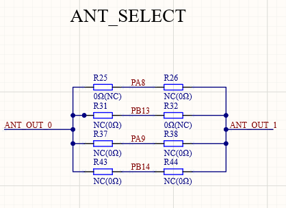
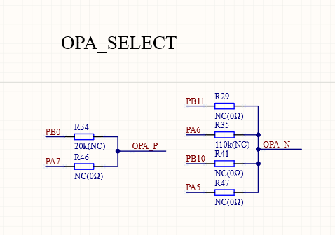
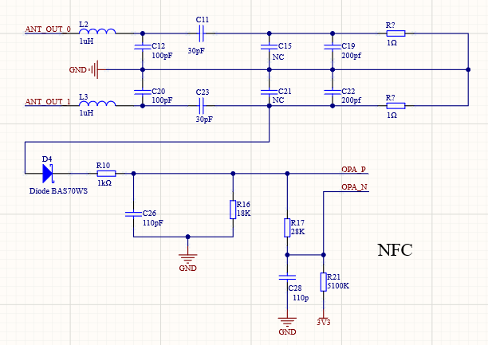

# CH32 NFC硬件

## 电路板介绍

NFC必须采用13.56Mhz频率作为基波进行通讯，所以晶振采用`13.56Mhz`或者`27.12Mhz`晶振。

默认使用串口2进行调试，即电路板上的PA2脚为调试串口输出。

## 硬件电路讲解

### 程序下载

电路板提供了三个按键，其中就有`Download`按键。使用typec线连接电路板至电脑，按住`Download`键，打开开关即可使用ISP工具下载。

### 天线输入选择

天线输入需要两路互补的13.56Mhz的PWM波形。本参考电路中提供了`ANT_SELECT`部分可以选择两种方案：

1. PA8和PB13是TIM1的CH1和CH1N通道对应的引脚。
2. PA9和PB14是TIM1的CH2和CH2N通道对应的引脚。

### 放大器输入选择

CH32V208板载两个放大器，可以通过焊接原理图中指定电阻进行修改。OPA正向输入端同时必须为ADC输入引脚，用做低功耗检卡使用。

### 放大器输出

放大器输出引脚必须为对应接收定时器的引脚，而且该引脚不能接线，防止影响接收。

### NFC电路

#### 天线部分

本电路中的参数是按照实际电路中天线匹配得到的参数，在PCB天线有变动时，电容的参数需要重新调整。

1uH电感使用的型号为：风华CMI321609U1R0KT（立创编码C74473）
具体参数：1uH ±10% 300mΩ

#### 解码部分

解码电路中的二极管必须使用给定的型号：**BAS70WS**，使用其他型号可能会导致无法正常工作。

## [返回主readme](../readme.md)
